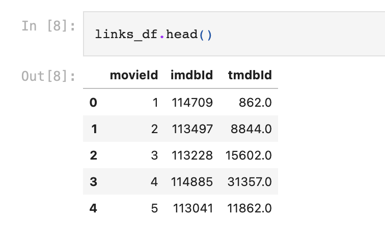
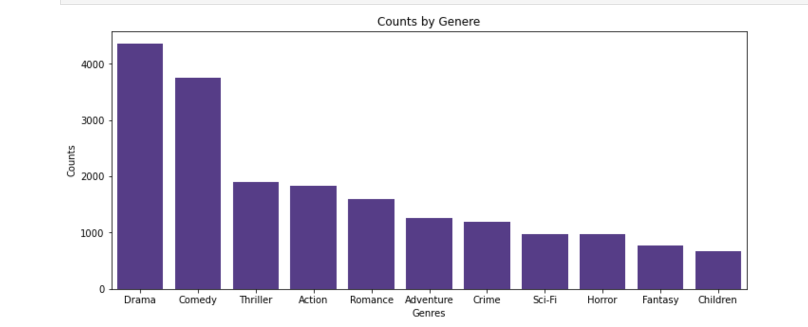
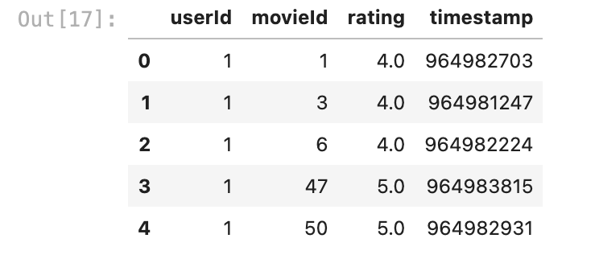
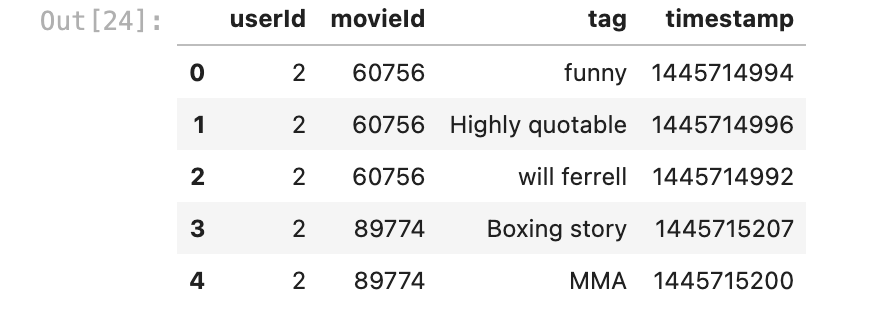
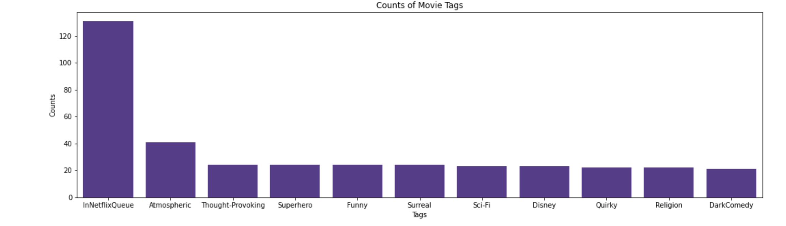
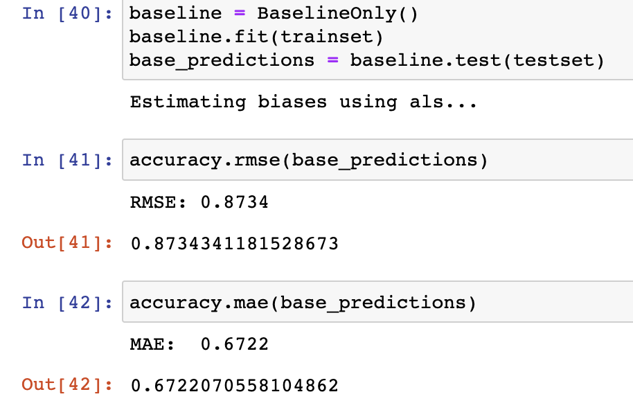
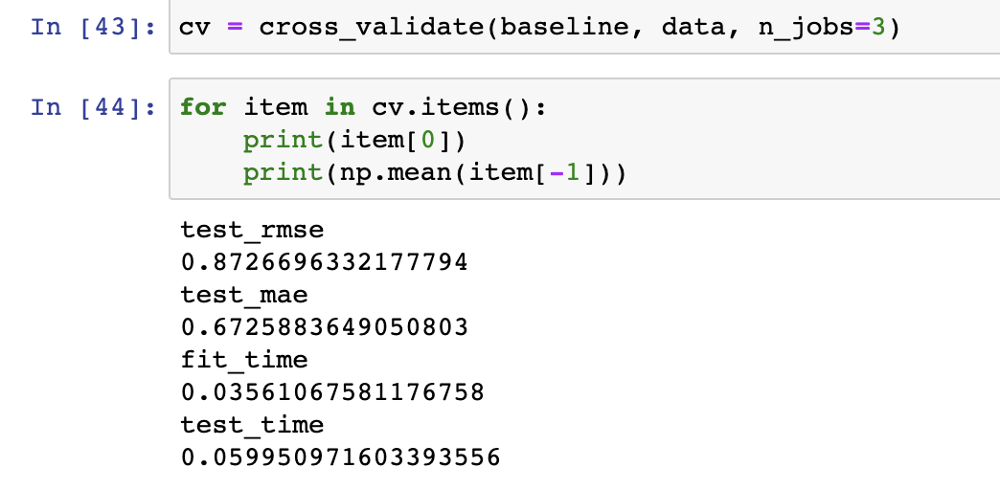
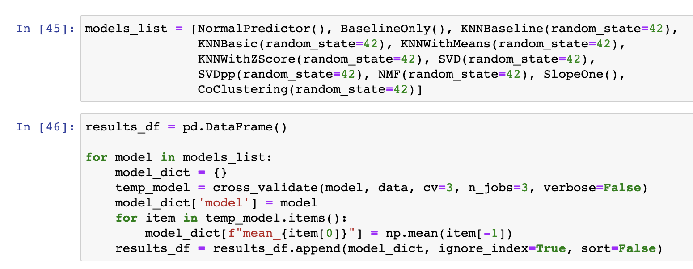
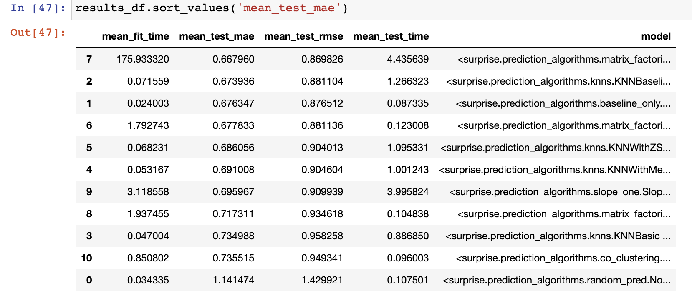
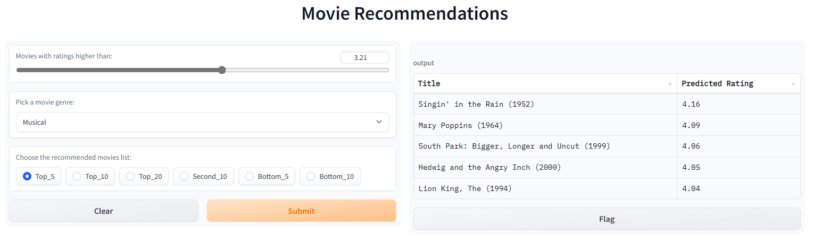

# Click That Recommendation Button 

Authors: Jasmine Huang, Jonathan Fetterolf, Matthew Duncan, & Michael Licul

## Overview

We analyzed a dataset from the GroupLens research lab at the University of Minnesota (https://grouplens.org/datasets/movielens/latest/). Since we ran our analysis on a smaller cloud platform, Gradio, instead of one of the larger cloud platforms, AWS or Google Cloud, we used a smaller dataset containg 100,000 user ratings.  

## Buisness Understanding

Our team has been tasked with implementing a recommendation system for the movie rental company, RedBox. The model will provide users with the top 5, top 10, or top 20 movie recommendation based on their ratings of other movies.

We have three main goals:
- Create a recommendation system model that allows users to input movie ratings and provides movie suggestions.
- Be able to store user ratings for future recommendation requests.
- Be able to provide specific genre recommendations based on a users request.

A successfully implemented recommender system can increase customer engagement, loyalty, satisfaction, and retention. All of which lead to an increase of sales.

## Data Source 

As mentioned, that data used for this project comes from multiple datasets from the GroupLens lab at the Unversisty of Minnesota. These datasets include: 
- links.csv
- movies.csv
- ratings.csv
- tags.csv

## Exploratory Data Analysis

### links_df 

This file is a key to merge movie identifiers with IMDB Database and The Movie DataBase. We will be focusing on the MovieLens database for this analysis and will not need this file.

### movies_df

This .CSV file will be very helpful for our analysis. It provides us with the title of movie in relation to its unique identifier and lets us know the genre categories that the movie would fall under.

There are 9737 unique movie titles. Repeats for 5 movies:
- Emma (1996) 2
- Saturn 3 (1980) 2
- Eros (2004) 2
- Confessions of a Dangerous Mind (2002) 2
- War of the Worlds (2005) 2

### ratings_df

This .CSV will be the primary datafile for this analysis. It includes relevant information including userId, rating, and movieId. timestamp is not relevant for this analysis and will be dropped. 
#add ratings_df head image

### tags_df

This .CSV could be helpful for analysis as it provides keyword insights to each of the films. timestamp will not be helpful for this analysis and will be dropped later.

## Creating New DataFrame

To better understand and work with the separate files, they have been merged to one, larger working file. After cleaning the merged DataFrame, we have 100,836 reviews for 9,724 movies.

## Modeling 

We will be using the Surprise library for this analysis. This library requires that data inputs be limited to three columns of information:
- User
- Movie
- Rating

### First Baseline Model

Setting up a baseline model using Surprise's `BaselineOnly` algorithm.

To get a more informative result of the baseline model, we have set up a cross-validation model. The results of the baseline model aren't bad with an RMSE of .87 and an MAE of .67.

### Checking Other Models 

To ensure we're using the best model for our analysis, we will be running all potential algorithms through three-fold cross-validation.

Our baseline model is still one of the top performers, though SVD++ provided the best results with a mean MAE of .668 and a mean RMSE of .87.

### GridSearch Top Model

To ensure that our top model is living up to its best potential, we are completing a gridsearch of SVD++ to find the best hyperparameters. Several iterations of GridSearch were completed and the search has been modified to adjust for past iterations (for instance `n_factors` continuously performed best with 20 factors and to speed up the search, other numbers were removed). Random state has been set for reproducibility.

For both RMSE and MAE metrics, our model performed best with:
- `n_factors` = 20
- `reg_all` = .01
- `lr_all` = .01
- `n_epochs` = 30

Utilizing GridSearch, we were able to reduce both error metrics. MAE was reduced to .662 from .668 and RMSE was reduced to .861 from .87. We will be using this model with the tuned parameters for our predictions. 

## Final Model 

We are creating a final model based on the results of our GridSearch.

- `n_factors` = 20
- `reg_all` = .01
- `lr_all` = .01
- `n_epochs` = 30

The Final Model produced an RMSE of 0.910 and a MAE of 0.695.

### Cross-Validating Final Model 

Final cross-validated results provide us with a mean MAE of .705 and a mean RMSE of .92. Time to predict the test set took an average of 4 seconds.

## New Users and Predictions 

Using the Python script located in the functions.py file within this repo. We are able to create new users who can provide movie ratings and save them to their profile. Users are able to request a number of recommended movies from 1-50 and can specify if they are interested in a specific genre.

When users create a new profile, they will be asked to create a username and password that can be used to access ratings that they have previously submitted. Users are able to make new ratings after logging back in to their profile or skip ahead to just pulling recommendations.

## Deployment Proof of Concept
#almsot done 

## Results and Conclusion

Our final model operates with a cross-validated mean absolute of error of .705 and a Root Mean Squared Error of .920.

This means we have an average difference between the predicted ratings and the actual ratings of .705 of 1 point on a scale of .5 to 5. It makes this prediction in about 4 seconds.

## Next Steps 

### More Data 

We would like to get more data in order to update and retrain the recommender system. More data likely means more accurate predictions.

In addition, we have data in the form of movies tags that we were not able to incorporate into this model. Given more time, we would like to utilize user feedback in the form of tags.

### Algorithms 

Given more time we'd like to utilize GridSearch on different algorithms for this model. We started by picking the best algorithm from untuned results, though further tuning of other prediction algorithms has the potential of outperforming the model we have selected.

### User Feedback 

It would be nice to include a way to incorporate user feedback on recommendations as part of the deployed app. This could help to gather more data and to make our model more accurate.

Allowing users to rate movies that they watch after our recommendation would be an additional performance check for the validity of the model.

### Deployment 

We would like to be able to deploy the app to the public if given more time and resources to host our model in the cloud.

<<<<<<< HEAD
=======

>>>>>>> de142ae83ca258769bcbc1e7fc46c348542de779

